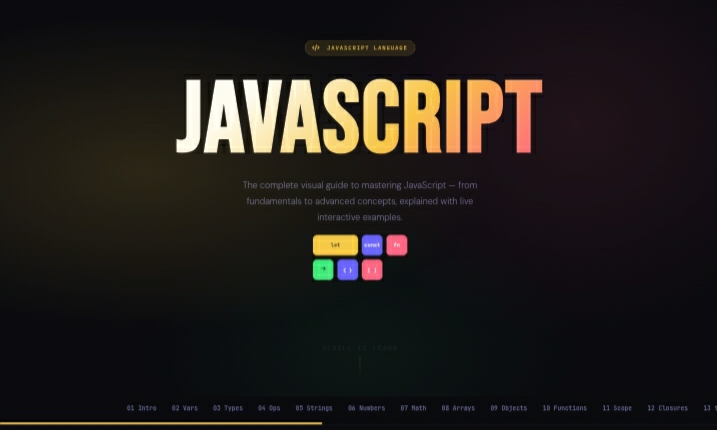
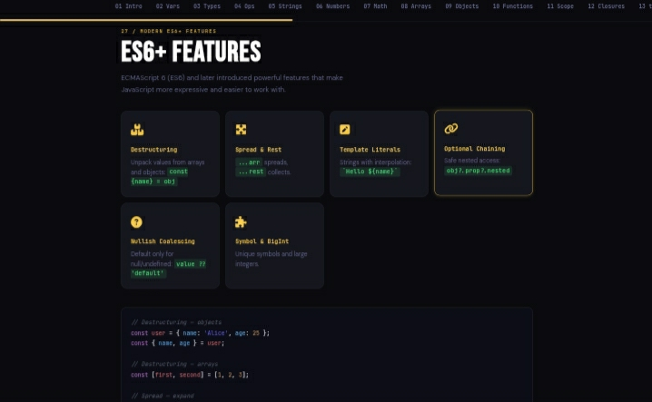

<!-- Modern README for JavaScript Visual Guide -->

<p align="center">
  
  
  
  
  
  
</p>

# 🌟 JavaScript Visual Guide
### The Ultimate Interactive JavaScript Learning Companion

<p align="center">
  <i>A complete visual journey through JavaScript — from basics to advanced mastery.</i>
</p>

> A fully interactive, self-contained JavaScript learning experience built in a single HTML file.  
> Covers everything from variables to advanced asynchronous programming with **31 structured sections**, **500+ live examples**, and **350+ animated diagrams**.  
> No frameworks. No build tools. No setup. Just open and learn.

---

## 🚀 Why this guide?

Learning JavaScript often feels scattered and overwhelming.  
This project solves that by bringing everything into one **visual, interactive, and structured experience**.

- 📘 Learn step-by-step from zero to advanced
- 🧠 Understand concepts visually, not just theoretically
- ⚡ Practice instantly with live examples
- 🎯 Avoid confusion with clear structured progression

---

## ⭐ Features

- 🎨 Modern glassmorphism UI with gradient design
- 📱 Fully responsive (mobile, tablet, desktop)
- ⚡ Pure HTML, CSS, and JavaScript (no dependencies)
- 📖 31 complete structured learning sections
- 🧪 500+ interactive live coding examples
- 📊 350+ animated visual diagrams
- 🔍 Built-in navigation and search system
- 🧠 Beginner-friendly explanations
- 💡 Real-world coding patterns
- 📌 Quick reference cheat sheets
- 💾 Works completely offline
- 📄 Single-file project (no setup required)

---

## 📋 Table of Contents

| # | Section | # | Section |
|---|---------|---|---------|
| 01 | Introduction | 17 | Classes |
| 02 | Variables (`var`, `let`, `const`) | 18 | DOM Manipulation |
| 03 | Data Types | 19 | Events |
| 04 | Operators | 20 | Asynchronous JS |
| 05 | Type Conversion | 21 | Promises |
| 06 | Strings | 22 | Async / Await |
| 07 | Numbers & Math | 23 | Fetch API |
| 08 | Arrays | 24 | Browser Storage |
| 09 | Objects | 25 | ES Modules |
| 10 | Functions | 26 | Regex |
| 11 | Scope & Hoisting | 27 | ES6+ Features |
| 12 | Closures | 28 | Advanced JS |
| 13 | `this` Keyword | 29 | Browser APIs |
| 14 | Loops | 30 | Performance |
| 15 | Conditionals | 31 | Cheat Sheet |
| 16 | Error Handling | | |

---

## 🖥️ Live Preview

<p align="center">
  
  
  
</p>

---

## 🛠️ How to Use

Just follow these simple steps:

```bash
git clone https://github.com/BilalBahij-dev/javascript
cd javascript-visual-guide
open index.html
